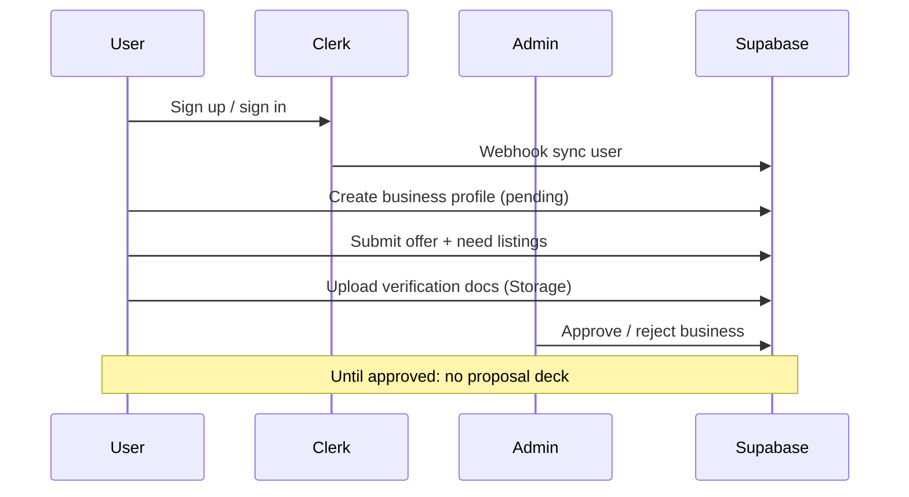
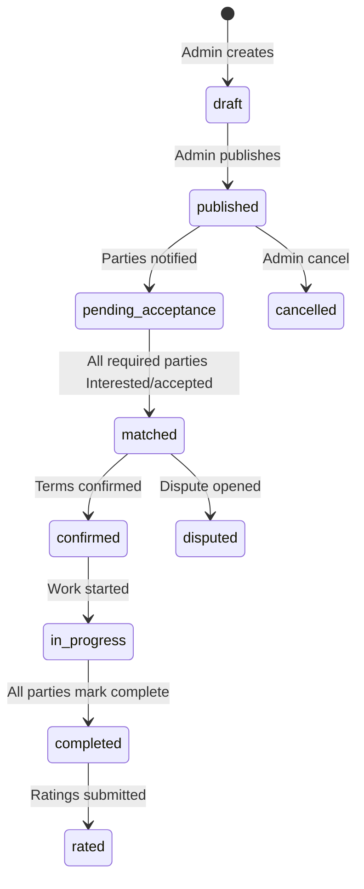
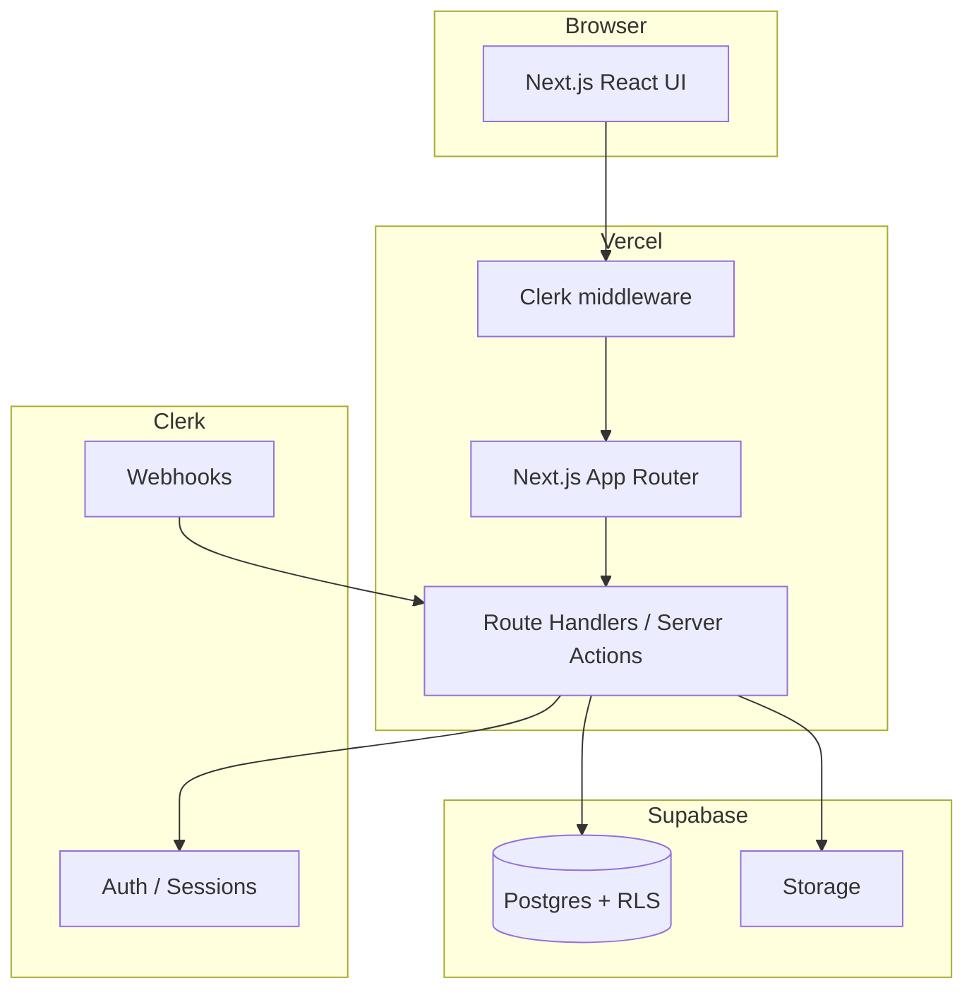
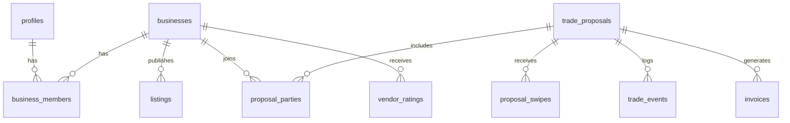

# Product Requirements Document — Reciproca

**Version:** 0.1 (MVP)  
**Status:** Draft  
**Last updated:** 2026-06-04  

**Related:** [Business plan](../README.md)

---

## 1. Summary

**Reciproca** is a closed, vetted B2B trade network. Businesses list what they **offer** and **need**; the platform surfaces **trade proposals** (including multi-party clears) in a **Tinder-style deck**. Users swipe **Interested** or **Pass** on concrete deals—not on vague “business profiles.” When all parties accept, they confirm terms, complete the trade, and rate outcomes to build vendor reputation.

**MVP goal:** Ship a web app that supports Phase 1 GTM—one metro, one vertical, concierge-backed proposals—with enough structure for tax-friendly records and trust scoring.

**Stack (decided):**

| Layer | Choice |
|-------|--------|
| Frontend + API | **Next.js** (App Router), TypeScript |
| Hosting | **Vercel** |
| Auth | **Clerk** |
| Database + Storage | **Supabase** (Postgres, RLS, Storage) |
| Payments (post-MVP) | Stripe (cash-topup, subscriptions) |

---

## 2. Problem & opportunity

See [README §3–4](../README.md). Condensed:

- Legacy barter exchanges rely on trade dollars, phone brokers, and weak quality signals.
- Direct 1:1 barter rarely clears; multi-party matching and trust data are missing.
- SMEs want to preserve cash while trading idle capacity—if they can trust counterparty delivery.

**MVP does not prove TAM.** It proves **liquidity in one vertical + metro**: completed trades per active business, and match-to-completion rate.

---

## 3. Goals & non-goals

### 3.1 Goals (MVP)

1. Onboard and **vet** businesses before they trade.
2. Capture structured **offers** and **needs**.
3. Show a **proposal deck** (swipe Interested / Pass / Save).
4. Run **multi-party acceptance** until all parties accept → **matched**.
5. **Confirm → execute → complete** flow with immutable proposal snapshot.
6. **Post-trade ratings** updating vendor reputation.
7. **Admin console** for concierge to create/publish proposals (Phase 1 primary matcher).
8. Generate **invoice PDFs** (or HTML export) per side for tax records.

### 3.2 Non-goals (MVP)

- Automated graph matching / embedding pipeline (Phase 2).
- Stripe billing, Pro tier, cash-topup settlement (Phase 2).
- Native mobile apps (responsive web first; PWA optional later).
- Public open marketplace / unvetted listings.
- Issuing trade dollars or internal currency redeemable off-platform.
- In-app chat beyond trade-scoped messages (optional stretch).

---

## 4. Users & roles

| Role | Description |
|------|-------------|
| **Business member** | Owner or delegate at a vetted company; swipes proposals, accepts trades, rates vendors. |
| **Admin / concierge** | Reciproca staff; vets businesses, drafts proposals, resolves disputes. |
| **System** | Webhooks (Clerk sync), cron (reminders), future matcher worker. |

**Persona (MVP):** SMB operator in a single service vertical (e.g. marketing ↔ cleaning ↔ print) in one metro, 5–50 employees, already barters informally or wants to.

---

## 5. Core user flows

### 5.1 Onboarding & vetting



**Requirements:**

- FR-1: Sign up / sign in via Clerk (email + OAuth as configured).
- FR-2: After auth, user must create or join a **business** (one user may belong to multiple businesses in v2; MVP: **one business per user**).
- FR-3: Business states: `pending` → `approved` | `rejected` | `suspended`.
- FR-4: Approved businesses can publish ≥1 **offer** and ≥1 **need** listing.

### 5.2 Proposal deck (Tinder for trades)

**Card content (each proposal):**

- Title + summary
- Trade type: `direct` | `multi_party`
- Per-party lines: business name, gives, receives, estimated FMV
- Optional **cash top-up** line (display only in MVP if not charging)
- Counterparty **outcome score** (aggregate)
- Metro + vertical tags

**Actions:**

| Action | Behavior |
|--------|----------|
| **Interested** (swipe right) | Records `interest` for this user’s business on this proposal |
| **Pass** (swipe left) | Records `pass`; optional reason (tags) for ops |
| **Save** | Bookmark; card can reappear later |
| **Details** | Full terms, parties, invoice preview stub |

**Requirements:**

- FR-10: Deck shows only proposals where user’s business is a participant and status is `published`.
- FR-11: Hide proposals already `passed` by this business (configurable TTL to resurface).
- FR-12: Empty state: “We’re building trades for you” + notify when new proposals exist (email later).

### 5.3 Match & execution



**Requirements:**

- FR-20: Proposal immutable snapshot at `published` (version id); edits require new version.
- FR-21: **Matched** when every required party has recorded **acceptance** (MVP: acceptance = Interested + explicit “Confirm match” step, or Interested counts as accept—pick one in implementation; default: **explicit confirm on match screen**).
- FR-22: Either party can mark **dispute** before `completed`; freezes reputation updates until admin resolves.
- FR-23: On `completed`, system generates **invoice records** per participating business (PDF generation MVP: server-side template → Storage URL).

### 5.4 Ratings & reputation

- FR-30: After completion, each participant rates **each other vendor** (1–5 + tags: quality, timeliness, communication).
- FR-31: Vendor **aggregate score** = rolling average (min 3 ratings before public display).
- FR-32: Scores visible on proposal cards and business public profile.

### 5.5 Admin / concierge

- FR-40: List pending businesses; approve/reject with notes.
- FR-41: CRUD proposals: pick businesses, define give/receive lines, publish to deck.
- FR-42: Dashboard: open trades, disputes, deck fill rate per business.
- FR-43: Impersonation **not** in MVP; use service role audit logs.

---

## 6. Feature phases

### Phase 1 — MVP (this PRD)

| Area | Scope |
|------|--------|
| Auth | Clerk sign-up/in, org-less single business |
| Vetting | Manual admin approval |
| Listings | Offers & needs (structured forms) |
| Matching | **Admin-authored proposals only** |
| Deck | Swipe UX + Save + Detail |
| Trades | State machine through `rated` |
| Invoices | Static PDF/HTML per completion |
| Admin | Web console at `/admin` |

**Exit criteria:** 10+ completed trades with 50 seeded businesses in pilot metro (per business plan Q1–Q2).

### Phase 2 — Density

- Automated proposal generation (graph + embeddings worker).
- Email/notifications (Resend).
- Stripe: Pro subscription + cash-topup.
- Self-serve proposal suggestions (admin approves).

### Phase 3 — Scale

- Multi-metro, multi-vertical.
- Clerk Organizations for multi-user businesses.
- Partner API, analytics, mobile polish.

---

## 7. Functional requirements (MVP checklist)

### 7.1 Business profile

| ID | Requirement |
|----|-------------|
| BP-1 | Legal name, DBA, metro, vertical, website, description |
| BP-2 | Verification docs upload (PDF/image) to private Storage bucket |
| BP-3 | Public slug for shareable vendor page (approved only) |

### 7.2 Listings

| ID | Requirement |
|----|-------------|
| L-1 | Offer: category, unit (hours, sessions, $, SKU), qty, FMV estimate, notes |
| L-2 | Need: same schema, `listing_type = need` |
| L-3 | Active/inactive toggle; inactive hidden from matcher (future) |

### 7.3 Proposals & deck

| ID | Requirement |
|----|-------------|
| P-1 | Admin creates proposal with ≥2 parties |
| P-2 | Each party has ≥1 give line and ≥1 receive line |
| P-3 | Member deck: swipe actions persisted |
| P-4 | Match screen when all accepts received |

### 7.4 Trades & compliance

| ID | Requirement |
|----|-------------|
| T-1 | FMV displayed; user acknowledges tax responsibility (checkbox) |
| T-2 | Audit log of status transitions (who, when) |
| T-3 | Invoice record: line items, parties, date, trade id |

### 7.5 Admin

| ID | Requirement |
|----|-------------|
| A-1 | Role gate: `admin` in Clerk `publicMetadata` or allowlist table |
| A-2 | Approve businesses, manage proposals, view disputes |

---

## 8. Technical architecture

### 8.1 High-level diagram



### 8.2 Stack details

| Component | Technology | Notes |
|-----------|------------|--------|
| Framework | Next.js 15+ App Router | Server Components default; client components for deck gestures |
| Language | TypeScript | Strict mode |
| Styling | Tailwind CSS | Match `frontend-ui.mdc` accessibility |
| Auth | `@clerk/nextjs` | `clerkMiddleware()`, `auth()` in handlers |
| DB client | `@supabase/supabase-js` + `@supabase/ssr` | Server: service role for admin; user-scoped for member |
| Migrations | Supabase CLI | `supabase/migrations/*` source of truth |
| Hosting | Vercel | Preview per PR; Production on main |
| PDF | `@react-pdf/renderer` or `puppeteer` on server | Evaluate bundle size; may use external render in Phase 2 |

### 8.3 Clerk + Supabase auth strategy

**Decision:** Clerk is the **identity provider**; Supabase is **data only** (not Supabase Auth for users).

| Pattern | Use |
|---------|-----|
| Clerk session in Next.js | All member + admin API routes call `auth()` |
| Clerk webhook | `user.created` / `user.updated` → upsert `profiles` row keyed by `clerk_user_id` |
| Supabase RLS | Policies use `clerk_user_id` from JWT **or** member routes use server client with manual checks |
| Recommended MVP path | **Server Actions / Route Handlers** validate Clerk, then query Supabase with **service role** and enforce `business_id` membership in code (simpler than JWT template setup) |
| Hardening (Phase 2) | [Clerk Supabase integration](https://clerk.com/docs/integrations/databases/supabase) — custom JWT so RLS can use `auth.jwt()->>'sub'` |

**Never:** `SUPABASE_SERVICE_ROLE_KEY` in client bundle or `NEXT_PUBLIC_*`.

### 8.4 Authorization matrix

| Action | Clerk | App check |
|--------|-------|-----------|
| View own deck | Signed in | User ∈ proposal party via `business_members` |
| Swipe proposal | Signed in | Business `approved` |
| Admin vetting | Signed in | `publicMetadata.role === 'admin'` |
| Read other business PII | Denied | Only public profile fields |

### 8.5 Project structure (proposed)

```
/
├── app/
│   ├── (marketing)/          # landing, legal
│   ├── (auth)/               # Clerk-hosted or embedded sign-in
│   ├── (app)/                # authenticated member
│   │   ├── onboarding/
│   │   ├── deck/
│   │   ├── trades/
│   │   └── profile/
│   ├── admin/                # concierge console
│   └── api/
│       ├── webhooks/clerk/
│       └── ...
├── components/
├── lib/
│   ├── supabase/             # server + browser clients
│   ├── clerk/
│   └── trades/               # state machine helpers
├── supabase/
│   ├── migrations/
│   └── config.toml
├── docs/
│   └── PRD.md
└── middleware.ts             # Clerk matcher
```

---

## 9. Data model (MVP)

### 9.1 Entity relationship (logical)



### 9.2 Tables (summary)

| Table | Purpose |
|-------|---------|
| `profiles` | `clerk_user_id`, name, email sync |
| `businesses` | Company record, vetting status, metro, vertical, reputation |
| `business_members` | `user_id`, `business_id`, `role` (owner, member) |
| `listings` | Offers/needs |
| `trade_proposals` | Proposal header, status, snapshot JSON, published_at |
| `proposal_parties` | business_id, role, give/receive JSON lines |
| `proposal_swipes` | business_id, proposal_id, action, reason |
| `proposal_acceptances` | Explicit accept for match |
| `trade_events` | Audit: status, actor, payload |
| `vendor_ratings` | rater business, rated business, trade_id, score, tags |
| `invoices` | trade_id, business_id, storage_path, totals |
| `verification_documents` | business_id, storage_path, reviewed_at |

**Enums:** `business_status`, `listing_type`, `proposal_status`, `swipe_action`.

Full SQL in `supabase/migrations/` (to be added in implementation).

### 9.3 RLS policy intent (when using user-scoped client)

- Members read/write rows for their `business_id` only.
- `trade_proposals`: read if party; write swipe/accept for own business.
- Admin role bypass via server service role only—not client.

---

## 10. Key screens

| Screen | Route | Description |
|--------|-------|-------------|
| Landing | `/` | Value prop, waitlist or apply |
| Sign in | `/sign-in` | Clerk |
| Onboarding | `/onboarding` | Business + listings + docs |
| Deck | `/deck` | Proposal cards, swipe |
| Trade detail | `/trades/[id]` | Status, confirm, complete, dispute |
| My business | `/profile` | Listings, scores, settings |
| Admin dashboard | `/admin` | Vetting queue, proposal editor |
| Public vendor | `/v/[slug]` | Approved business + public score |

---

## 11. Non-functional requirements

| Category | Requirement |
|----------|-------------|
| **Security** | Clerk on all protected routes; input validation (Zod); no secrets client-side; file upload size/MIME limits |
| **Privacy** | Verification docs private bucket; PII not in logs |
| **Performance** | Deck interaction <100ms perceived; server actions <500ms p95 for swipe |
| **Availability** | Vercel SLA; Supabase hosted HA |
| **Accessibility** | WCAG 2.1 AA for core flows; swipe alternatives (buttons) |
| **Observability** | Structured logs with `requestId`; PostHog events (optional): `proposal_swiped`, `trade_completed` |

---

## 12. Environment variables

Document in `.env.example` (names only):

```bash
# Clerk
NEXT_PUBLIC_CLERK_PUBLISHABLE_KEY=
CLERK_SECRET_KEY=
CLERK_WEBHOOK_SIGNING_SECRET=
NEXT_PUBLIC_CLERK_SIGN_IN_URL=/sign-in
NEXT_PUBLIC_CLERK_SIGN_UP_URL=/sign-up

# Supabase
NEXT_PUBLIC_SUPABASE_URL=
NEXT_PUBLIC_SUPABASE_ANON_KEY=
SUPABASE_SERVICE_ROLE_KEY=

# App
NEXT_PUBLIC_APP_URL=
```

---

## 13. Success metrics

| Metric | MVP target (pilot) |
|--------|-------------------|
| North star | Completed trades / active business / month ≥ 0.5 |
| Liquidity | ≥40% needs get a published proposal within 14 days |
| Deck engagement | ≥60% weekly active businesses open deck |
| Match quality | Match → completed ≥50% |
| Trust | ≥80% trades receive ratings within 7 days |

---

## 14. Risks & open questions

| # | Question | Default for MVP |
|---|----------|-----------------|
| Q1 | Interested = accept, or separate confirm step? | Separate **Confirm match** screen after all Interested |
| Q2 | First metro + vertical? | **TBD** — must be set before seeding |
| Q3 | FMV who validates? | Honor system + admin review on dispute |
| Q4 | Clerk admin role vs DB `admins` table? | Clerk `publicMetadata.role` |
| Q5 | Multi-business per user? | Defer; schema allows later |

---

## 15. Implementation milestones

| Week | Deliverable |
|------|-------------|
| W1 | Repo scaffold: Next.js, Clerk, Supabase migrations, webhook sync |
| W2 | Onboarding + vetting + listings |
| W3 | Admin proposal builder + publish |
| W4 | Deck UI + swipe persistence + match flow |
| W5 | Trade lifecycle + ratings + invoice export |
| W6 | Polish, admin dashboard, pilot hardening |

---

## 16. Appendix — swipe UX spec

**Desktop:** Card center; buttons Interested / Pass / Save; keyboard shortcuts optional.  
**Mobile:** Touch swipe with button fallback; one card full viewport.

**Proposal card hierarchy:**

1. Headline (“3-way trade” / “Direct trade”)
2. Your role summary (“You give X · You get Y”)
3. Other parties (collapsed, expand in Details)
4. FMV estimate total
5. Vendor score chips
6. CTA: Interested primary, Pass secondary

**Haptic:** optional on mobile; not required MVP.

---

## 17. References

- [Business plan](../README.md)
- [Clerk + Supabase integration](https://clerk.com/docs/integrations/databases/supabase)
- [Supabase RLS](https://supabase.com/docs/guides/auth/row-level-security)
- [Vercel + Next.js](https://nextjs.org/docs/app/building-your-application/deploying)
